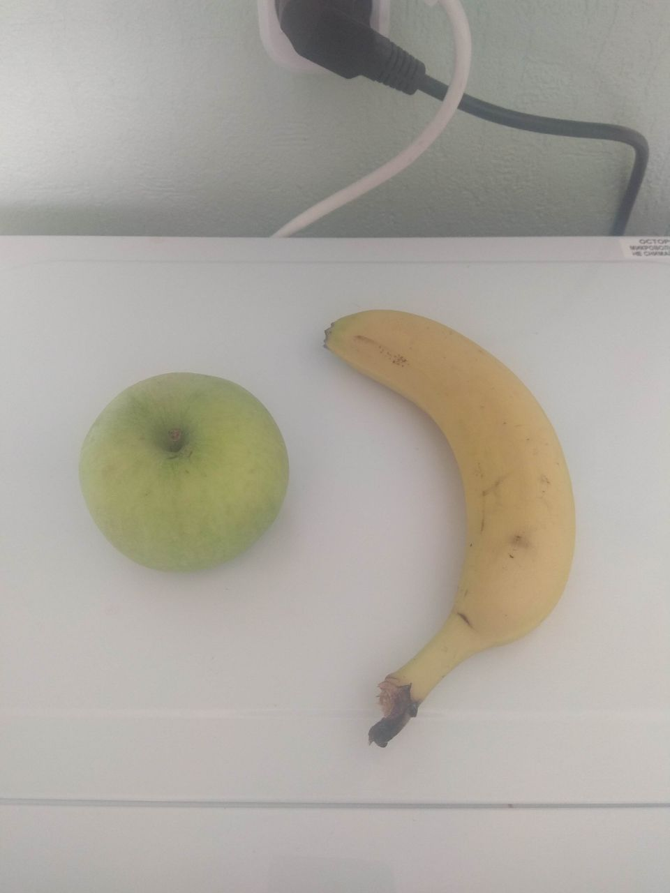
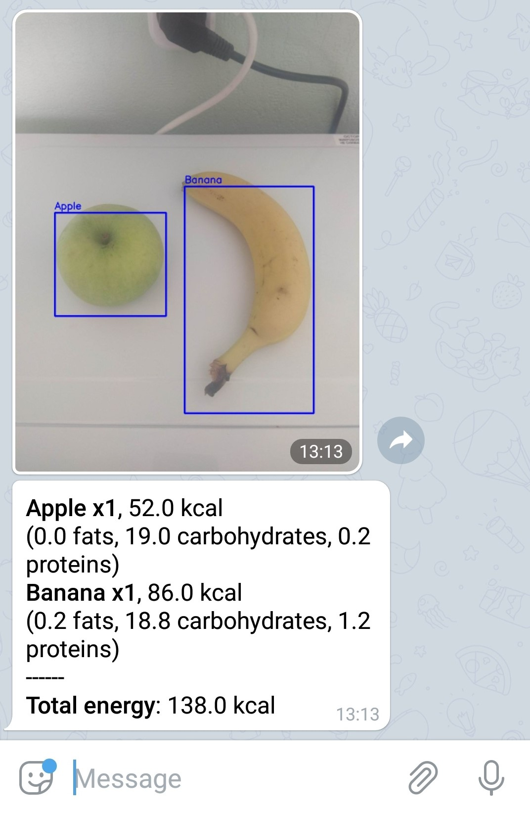

# Overview

This repository contains source code for Telegram bot, which can detect and analyze food objects by photo. It's main function is to print nutrition facts about a dish in response to your photo.
Here is an example:

 

# Technical details:

* YOLO v3 is used as a detector pretrained on Open Images v4 dataset (500 classes).
* Model is converted to TensorFlow/Keras for ease of use.
* Processing of one images on CPU takes 5-6 seconds. 
* As postprocessing of YOLO output takes a long time (~30-40 seconds for one image on local machine) for all 500 classes I selected only food-related classes (59 classes) information from entire output tensor and sent it to postprocessing block. This procedure decreases processing time to 5-6 seconds per image.
* YOLO detector is not very accurate, so replacing it with another one (for example, from R-CNN family) or training on larger and more diverst dataset could improve its performance. But excellent performance was not my goal in this pet-project.

# Usage
0. Download this repo in your working directory. 
1. Type in command line _pip install -r requirements.txt_ from calorie_counter directory. 
1. Download pretrained weights for YOLO v3 from this [link](https://github.com/radekosmulski/yolo_open_images).
2. Convert Darknet model to Keras using this [link](https://github.com/qqwweee/keras-yolo3).
3. Put converted model with _.h5_ extention in calorie_counter/bot/model folder.
4. From command line or IDE run _main.py_ file.
5. Done! Your bot is working!

## Other resources
https://github.com/experiencor/keras-yolo3
